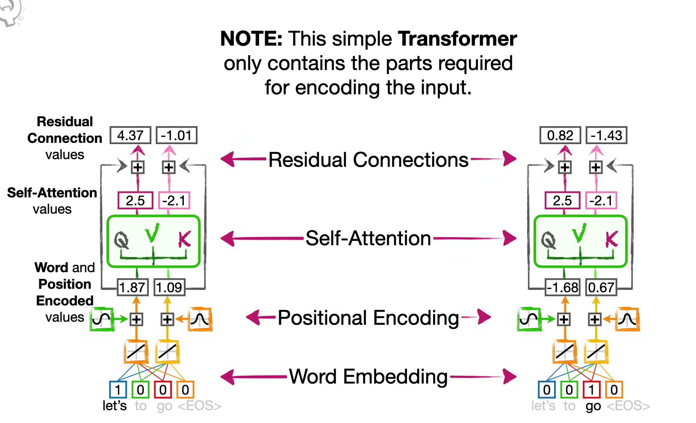

## Day 12: Transformer - Complete Beginner's Guide

### Video links:
https://youtu.be/zxQyTK8quyY?si=KAO3bmpXsfMjl8Q3  (StatQuest)

https://youtu.be/eMlx5fFNoYc?si=Hwo_ENMnT92VK_ug

## 1. What is a Transformer?
Transformer is a neural network architecture introduced in the 2017 paper "Attention Is All You Need". It revolutionized how we process sequential data like text, and is now the foundation of modern AI models like GPT, BERT, and even Vision Transformers.




The Big Idea:

Instead of processing words one by one like RNNs, Transformers look at all words at once and figure out how they relate to each other.

```
RNN:         Word1 → Word2 → Word3 → Word4 → (slow, sequential)

Transformer: [Word1, Word2, Word3, Word4] → (fast, parallel)
             All words processed simultaneously!

Simple Analogy: Reading a Book

Approach	           How it Works	                                                  Problem
RNN	                   Read page 1, remember, read page 2, remember, read page 3...	  Slow, forgets early pages
Transformer	           Look at ALL pages at once, draw connections between them	      Fast, sees everything
```
### 2. Why Transformer Replaced RNN
```
Aspect	                RNN/LSTM	                        Transformer	                       Why It Matters
Processing	            Sequential(one word at a time)	    Parallel(all words together)	   Transformer is MUCH faster
Memory	                Hidden state passes information	    Direct connections between words   Can remember long-range dependencies
Training Time	        Days to weeks	                    Hours to days	                   Practical for large models
Long Sequences	        Forgets after ~100 words	        Works for thousands of words	   Powers modern LLMs
Context Understanding	Limited by memory	                Each word attends to all others	   Better understanding

Visual Comparison:

RNN Processing:
Time 1: "The" → h₁
Time 2: "cat" → h₂ (remembers "The")
Time 3: "sat" → h₃ (remembers "The cat")
Time 4: "on"  → h₄ (remembers "The cat sat")
... and so on (SLOW)

Transformer Processing:
        ┌─────────────────────────────────┐
        │  The   cat   sat   on   the  mat│
        └────┬───┬─────┬────┬────┬────┬──┘
             │   │     │    │    │    │
             └───┴─────┴────┴────┴────┘
        All words processed simultaneously! (FAST)
```        
### 3. Core Concept: Attention = Query, Key, Value mechanism
What is Attention?

Attention is a mechanism that allows the model to focus on relevant parts of the input when processing each word.
```
Real-World Analogy:

When you read: "The cat sat on the mat"

To understand "sat", you need to know:
- WHO sat? → "cat" (important!)
- WHERE? → "mat" (important!)
- Other words? → "the", "on" (less important)

Attention = Model learns to focus on "cat" and "mat" when processing "sat"

Visualizing Attention:
Sentence: "The cat sat on the mat"

Word: "sat" attends to (focuses on):
┌─────┬─────┬─────┬─────┬─────┬─────┐
│ The │ cat │ sat │ on  │ the │ mat │
│0.05 │0.45 │0.10 │0.05 │0.05 │0.30 │  ← Attention weights
└─────┴─────┴─────┴─────┴─────┴─────┘
        ↑                   ↑
    "cat" (0.45)       "mat" (0.30)
    Most important     Second most important
```    
### 4. Self-Attention
```
Definition:
Self-Attention means each word looks at ALL other words in the same sentence to understand context.

Step-by-Step Example:

Sentence: "The bank of the river"

Processing word: "bank" (which meaning? river bank or money bank?)

Step 1: Look at all words including "bank" itself
┌────────┬────────┬────────┬────────┬────────┐
│  The   │  bank  │   of   │  the   │  river │
└────────┴────────┴────────┴────────┴────────┘

Step 2: Calculate relevance scores
- "river" → highly relevant (river bank)
- "of" → somewhat relevant
- "the" → less relevant

Step 3: Update understanding of "bank"
Now model knows: "bank" means river bank, not money bank!

Why Self-Attention is Powerful:
Without Self-Attention	   With Self-Attention
"bank" = ambiguous	       "bank" = river bank (from context)
Each word isolated	       Words share information
No context	               Full context available
```
### 5. Q, K, V: The Magic Triplet
```
The Core Intuition:
Think of Q, K, V like a library search system:

Component	     Library Analogy	    In Transformer
Query (Q)	     Your search query	    What current word is looking for 
Key (K)	         Book titles/tags	    What each word offers (relationship or context)
Value (V)	     Book content	        Actual information to extract

Simple Example:
You're searching for books about "machine learning"

Query (Q) = "machine learning" (what you want)

Keys (K) = Book titles: 
    Book1: "Deep Learning" 
    Book2: "Cooking Recipes"
    Book3: "Neural Networks"

Values (V) = Book contents:
    Book1: [chapter1, chapter2, ...]
    Book2: [ingredients, steps, ...]
    Book3: [neurons, layers, ...]

Process:
1. Compare Query with each Key → similarity scores
2. Book1 (0.9), Book3 (0.8), Book2 (0.1)
3. Extract Values based on scores → mostly Book1 and Book3 content
In Transformer Terms:

For word "sat" in sentence "The cat sat on mat":

Query (Q) = "sat looking for subject and location"
Keys (K) = each word's identity: ["The", "cat", "sat", "on", "mat"]
Values (V) = actual word meanings

Attention = softmax(Q·K/√d) · V
              ↓             ↓
           relevance    weighted
           scores       information
```           
### 6. The Attention Formula (Simplified)
```
Attention(Q, K, V) = softmax( Q·Kᵀ / √dₖ ) · V

Breaking It Down:

Part	  What It Does	                             Analogy
Q·Kᵀ	  Compares Query with all Keys	             Matching search query with book titles
/√dₖ	  Scaling (prevents extreme values)	         Normalizing scores
softmax	  Converts scores to probabilities (0-1)	 Ranking results
× V	      Extracts information based on importance	 Getting book content

Numerical Example (Simplified):

Step 1: Q·Kᵀ (similarity scores)
        cat: 0.8,  mat: 0.7,  the: 0.2,  on: 0.3   (if similar, higher score)

Step 2: softmax (convert to probabilities)
        cat: 0.45, mat: 0.35, the: 0.10, on: 0.10

Step 3: × V (multiply by word meanings)
        Output = 0.45×cat_meaning + 0.35×mat_meaning + ... (word meanings are vectors of numbers for each word from the vocabulary which is stored in the network)
```        
### 7. Complete Transformer Architecture
```
High-Level View:
Input Sentence: "The cat sat"
         ↓
┌─────────────────────────┐
│    Embedding Layer      │  (Convert words to vectors using pretrained embeddings)
│[numbers that represent words]
└───────────┬─────────────┘
            ↓
┌─────────────────────────┐
│  Positional Encoding    │  (Add position information using sin and cos functions because wrords have order)
│ "Word 1, Word 2, Word 3"
└───────────┬─────────────┘
            ↓
┌─────────────────────────┐
│   Transformer Block     │
│  ┌───────────────────┐  │
│  │ Multi-Head        │  │  (Multiple attention mechanisms)
│  │ Self-Attention    │  │   looking for different patterns
│  └─────────┬─────────┘  │
│            ↓            │
│  ┌───────────────────┐  │
│  │  Feed Forward     │  │  (Process information)
│  │  Neural Network   │  │
│  └───────────────────┘  │
│  (Repeat multiple times)│
└───────────┬─────────────┘
            ↓
┌─────────────────────────┐
│      Output Layer       │  (Final predictions)
└─────────────────────────┘
Encoder-Decoder Structure:

Original Transformer has two parts:

┌─────────────────────────────────────────────────────┐
│                    TRANSFORMER                      │
├─────────────────────────────────────────────────────┤
│                                                      │
│  ENCODER (Understands input)                         │
│  ┌─────────────────┐                                 │
│  │ Self-Attention  │                                 │
│  │   Feed Forward  │                                 │
│  └────────┬────────┘                                 │
│           │                                          │
│           ▼                                          │
│  DECODER (Generates output)                          │
│  ┌─────────────────┐                                 │
│  │ Self-Attention  │                                 │
│  │ Cross-Attention │  (Looks at encoder output)      │
│  │   Feed Forward  │                                 │
│  └─────────────────┘                                 │
│                                                      │
└─────────────────────────────────────────────────────┘

Example: Translation
Encoder: Reads "I love AI"
Decoder: Generates "J'aime l'IA" one word at a time
```
### 8. Why Transformer is Revolutionary
```
Before Transformer (RNN Era):

❌ Slow sequential processing
❌ Can't train on large datasets
❌ Limited context window
❌ Forget long-range dependencies
After Transformer:

✅ Parallel processing (fast!)
✅ Can train on entire internet
✅ 1000+ token context (token = word or character)
✅ Perfect long-range memory

Impact on AI:
Model	                   Based On	                       What It Does
GPT	                       Transformer Decoder	           Generates text
BERT	                   Transformer Encoder	           Understands text
Vision Transformer (ViT)   Transformer on images	       Classifies images
CLIP	                   Transformer + Image Encoder	   Connects text and images
```
### 9. Simple Analogy Summary
```
Restaurant Kitchen Analogy:

OLD WAY (RNN):
One chef cooks dishes one by one:
Dish1 → Dish2 → Dish3 → Dish4 (slow, can't go back)

NEW WAY (Transformer):
Multiple chefs work on all dishes simultaneously:
┌─────────────────────────┐
│ Dish1  Dish2  Dish3  Dish4 
│  👩‍🍳    👨‍🍳    👩‍🍳    👨‍🍳   
│ They communicate and    │
│ share ingredients       │
│ (attention)             │
└─────────────────────────┘
Faster, better coordination!
QKV Restaurant Analogy:
Component	Restaurant	                        Transformer
Query (Q)	"I need ingredients for pasta"	    What current word needs
Keys (K)	Menu items: pasta, pizza, salad	    What other words offer
Values (V)	Recipes and ingredients	            Actual word information
Attention	Getting pasta recipe from chef	    Getting relevant context
```
### 10. Key Takeaways
```
┌─────────────────────────────────────────────────────────┐
│              TRANSFORMER - CHEAT SHEET                  │
├─────────────────────────────────────────────────────────┤
│                                                          │
│  WHAT: Neural network that processes all data in parallel│
│                                                          │
│  WHY BETTER:                                             │
│  • Faster (parallel instead of sequential)               │
│  • Longer memory (direct connections)                    │
│  • Better understanding (attention to all words)         │
│                                                          │
│  CORE IDEA: Self-Attention                               │
│"Each word looks at all other words to understand context"│
│                                                          │
│  Q, K, V:                                                │
│  • Query: What I'm looking for                           │
│  • Key: What others offer                                │
│  • Value: Actual information                             │
│                                                          │
│  FORMULA: Attention(Q,K,V) = softmax(QKᵀ/√d)V            │
│                                                          │
│  IMPACT: Powers ALL modern AI (GPT, BERT, ViT, CLIP)     │
│                                                          │
└─────────────────────────────────────────────────────────┘
```
### 11. Memory Aid: Transformer in 5 Steps
```
1. EMBED: Convert words to numbers
2. ATTEND: Each word looks at all others
3. COMPUTE: QKV calculations find relevance
4. PROCESS: Feed-forward network refines understanding
5. REPEAT: Multiple layers build deep understanding

Mnemonic: "Every Amazing Transformer Creates Powerful Results"
- Embed
- Attend
- Transform
- Compute
- Process
- Repeat
```
### 12. What This Means for Your Research
```
Journey So Far:
MLP → CNN → RNN → LSTM → TRANSFORMER (You are here!)
 ↓     ↓      ↓      ↓          ↓
Basic  Images  Text   Long      ⭐ ALL MODERN AI ⭐
                            (GPT, BERT, ViT, CLIP)

Next Steps:
Transformer → Vision Transformer → Multimodal LLMs
    ↓                ↓                   ↓
  Text AI        Image AI         Text + Image AI
Remember: Every modern AI model you've heard about (ChatGPT, DALL-E, Midjourney) is built on Transformers. Today you learned the foundation of all of them!
```

 ### 13. Cross-Attention
```
Cross-Attention (2 MIN EXPLANATION)


🔹 Self-Attention (you already know)

Word looks at:
👉 same sentence

"The cat sat"
  ↑
 looks at cat, sat, etc.

🔹 Cross-Attention (NEW)

Decoder looks at:
👉 encoder output

Example (Translation)

Input:

"I love AI"

Output:

"Je aime IA"

What happens:

Encoder processes:

"I love AI"

Decoder generating:

"Je"

👉 It asks:

“Which input word is important?”

→ looks at "I"

So:
Type         	Looks at
Self-Attention	Same sequence
Cross-Attention	Other sequence

🔥 ONE LINE DEFINITION

Cross-attention = Output attends to Input
```
### 14. Multi-Head Attention (INTUITIVE)
```
Instead of ONE attention:

👉 You have 8 (because nhead=8)

Think like this:

Sentence:

"The cat sat on the mat"

Different heads focus on:

Head	Learns
Head 1	subject (cat)
Head 2	position (on)
Head 3	object (mat)
Head 4	grammar
...	...

👉 Then all heads combine → better understanding

🧠 FINAL CHECK (VERY IMPORTANT)

If you understand this, you're DONE:

✅ Transformer = parallel processing
✅ Attention = focus on important words
✅ QKV = how attention works
✅ Self-attention = same sentence
✅ Cross-attention = input ↔ output
✅ Multi-head = multiple perspectives

```

### 15. explain the working of transformer using attention ,qkv values....i mean these work inside....self attention i s qkv right? and what these qkv does? update wordembedding values or what.....suppose a sentence has 2 words how will they change their values what will be new values...describe with an example and then these values will be used in decoder right using the encode context awarness

```
🧠 First: Yes, Self-Attention = Q, K, V

👉 Every word is converted into:

Q (Query) → what this word is looking for

K (Key) → what this word offers

V (Value) → actual information of the word

🔥 What actually happens?
Input sentence:
"cat eats"

Assume:

embedding size = 2 (small for understanding)

🔹 Step 1: Word Embeddings

Each word becomes a vector:

cat  → [1, 0]
eats → [0, 1]

👉 This is initial meaning (very basic)

🔹 Step 2: Create Q, K, V

We multiply embeddings with weight matrices:

Q = XWq
K = XWk
V = XWv

Let’s assume (simplified):

Q_cat  = [1, 0]
K_cat  = [1, 0]
V_cat  = [1, 0]

Q_eats = [0, 1]
K_eats = [0, 1]
V_eats = [0, 1]
🔥 Step 3: Attention Calculation
👉 For word: "cat"

We compute similarity with all keys:

Dot products:
cat · cat  = 1
cat · eats = 0
👉 Apply softmax
[1, 0] → [0.73, 0.27]  (approx)

👉 Meaning:

cat attends mostly to itself

little bit to “eats”

👉 Compute new value
new_cat =
0.73 × V_cat + 0.27 × V_eats

= 0.73×[1,0] + 0.27×[0,1]
= [0.73, 0.27]
👉 For word: "eats"

Dot products:

eats · cat  = 0
eats · eats = 1

Softmax:

[0, 1] → [0.27, 0.73]

New value:

new_eats =
0.27×[1,0] + 0.73×[0,1]
= [0.27, 0.73]
🎯 FINAL OUTPUT AFTER SELF-ATTENTION
cat  → [0.73, 0.27]
eats → [0.27, 0.73]
🧠 What just happened?

👉 Originally:

cat  → only cat meaning
eats → only eats meaning

👉 After attention:

cat now knows about "eats"
eats now knows about "cat"

🔥 This is called:

context-aware embeddings

❗ Your Important Question:
👉 “Does QKV update embeddings?”

✔️ YES (indirectly)

Q, K, V are used to compute attention

Attention produces new embeddings

These replace old ones

👉 So:

old embedding → attention → new embedding (context aware)
🔥 Where does this go next?

After self-attention:

New embeddings
      ↓
Feed Forward Network (MLP)
      ↓
Next transformer layer (repeat)

👉 After multiple layers:

embeddings become VERY rich

🔥 Encoder → Decoder Flow
Encoder:

Applies self-attention

Produces:

Context-aware embeddings
Decoder:

Uses TWO attentions:

1. Self-attention (on output)

→ understand generated words

2. Cross-attention 🔥
Q = decoder output
K, V = encoder output

👉 Meaning:

Decoder looks at encoder to decide next word

🧠 Simple Full Flow
Input sentence → embeddings
              ↓
        Self-Attention (QKV)
              ↓
   Context-aware embeddings
              ↓
        Encoder output
              ↓
        Decoder (cross-attention)
              ↓
        Final output
⚡ Final Intuition

👉 Think like this:

Q = “What do I need?”

K = “What do others have?”

V = “What information they give”

👉 Attention =

“Who should I listen to more?”

🔥 One-line killer understanding

Transformer updates each word’s meaning by mixing information from all other words using attention weights.
```


