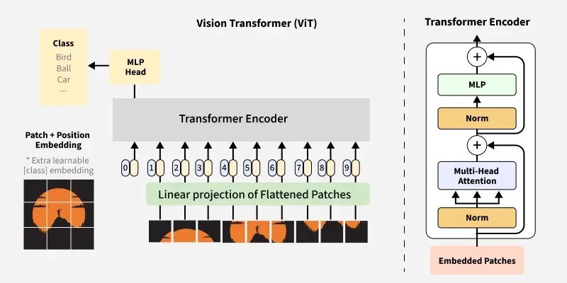

## Day 14: Vision Transformer (ViT) - Complete Theory Guide

### Video links:
https://youtu.be/aIi5FsdURUA?si=yt0pN3JynBq8N7uR   (CNN drawbacks + Trnasformer + ViT explained)

### Transformer Explainer website: 

https://poloclub.github.io/transformer-explainer/

### 1. What is Vision Transformer (ViT)?
Vision Transformer (ViT) is a groundbreaking architecture that applies the Transformer model (originally designed for NLP: natural language processing, which means it can understand and generate text) directly to images. Instead of using convolutions, ViT treats an image as a sequence of patches and processes them using self-attention mechanisms.



```
The Core Idea:
Traditional CNN: Looks at local regions → gradually builds global understanding
Vision Transformer: Looks at entire image at once → captures global relationships immediately

Why This Matters:
For years, CNNs dominated computer vision. ViT showed that with enough data, Transformers can match or exceed CNN performance by learning relationships between all parts of an image simultaneously.
```

### 2. How ViT Works: Step by Step
```
Vision Transformer (ViT) = Encoder Only [Its mainly used for image classification, no generation]
Encoder: Understanding (text, images, etc.)
Decoder: Generation (text, images, etc.)

The Simple Truth:

ViT Architecture:
Input Image → Patches → Embeddings → Transformer ENCODER → Classification Head
                                                    ↑
                                              NO DECODER!

Why Encoder Only?
Model Type	                Architecture	    Purpose
ViT (Vision Transformer)	Encoder ONLY	    Image CLASSIFICATION
GPT (Text Generation)	    Decoder ONLY	    Text GENERATION
Original Transformer	    Encoder + Decoder	Translation (seq2seq)

Visual Comparison:

Original Transformer (Translation):
Encoder: "I love AI" → [Context] → Decoder: "J'aime l'IA"
         ↑                              ↑
    Understanding                    Generation

ViT (Image Classification):
Encoder: [🐱🐶🐦] → [Understanding] → Class Label
         ↑
    Understanding only (no generation!)


What ViT Does:

1. Splits image into patches (like words)
2. Encoder processes patches with self-attention
3. CLS token collects global information
4. Classification head outputs ONE label

That's it! No decoder needed because:
- We're not generating new sequences
- We're only classifying what we see

Key Insight:
ViT = "What is this?" (understanding)
GPT = "Write something" (generation)

ViT is BERT's cousin, not GPT's cousin!
Both use only encoder for understanding tasks.

Visual Pipeline:

Input Image
    ↓
┌──────────────────────────────────────────────────────┐
│ Step 1: Split into Patches                           │
│                                                      │
│   ┌────┬────┬────┬────┐                              │
│   │ P1 │ P2 │ P3 │ P4 │                              │
│   ├────┼────┼────┼────┤                              │
│   │ P5 │ P6 │ P7 │ P8 │  ← Each patch = 16×16 pixels │ 
│   ├────┼────┼────┼────┤                              │
│   │ P9 │ P10│ P11│ P12│                              │
│   ├────┼────┼────┼────┤                              │
│   │ P13│ P14│ P15│ P16│                              │
│   └────┴────┴────┴────┘                              │
└──────────────────────────────────────────────────────┘
    ↓
┌───────────────────────────────────────────────────────┐
│ Step 2: Patch Embedding                               │
│                                                       │
│ Each patch → Linear projection → Vector (768 dims)    │
│                                                       │
│ [P1] → [e1]                                           │
│ [P2] → [e2]                                           │
│ ...                                                   │
│ [P16] → [e16]                                         │
└───────────────────────────────────────────────────────┘
    ↓
┌───────────────────────────────────────────────────────┐
│ Step 3: Add Positional Encoding(Sinusoidal)           │
│                                                       │
│ [e1] + pos1 → [embed1]                                │
│ [e2] + pos2 → [embed2]  ← So model knows patch order  │
│ ...                                                   │
│ [e16] + pos16 → [embed16]                             │
└───────────────────────────────────────────────────────┘
    ↓
┌───────────────────────────────────────────────────────┐
│ Step 4: Add Classification Token (CLS)                │
│                                                       │
│ [CLS] + [embed1] + [embed2] + ... + [embed16]         │
│   ↑                                                   │
│ Special token that learns to represent the whole image
└───────────────────────────────────────────────────────┘
    ↓
┌───────────────────────────────────────────────────────┐
│ Step 5: Transformer Encoder                           │
│                                                       │
│ ┌─────────────────────────────────────────────────┐   │
│ │ Multi-Head Self-Attention (patches attend to all)│  │
│ │              ↓                                   │  │
│ │        Add & Normalize                           │  │
│ │              ↓                                   │  │
│ │        Feed Forward Network                      │  │
│ │              ↓                                   │  │
│ │        Add & Normalize                           │  │
│ └─────────────────────────────────────────────────┘   │
│ Repeat N times (typically 12 layers)                  │ (THis transformer head is repeated 12 times for ViT-base, 24 times for ViT-large.)
└───────────────────────────────────────────────────────┘
    ↓
┌───────────────────────────────────────────────────────┐
│ Step 6: Classification Head                           │
│                                                       │
│ Take CLS token output → MLP → Class probabilities     │
│                                                       │
│ [CLS_output] → [cat:0.9, dog:0.05, bird:0.03, ...]    │ 
└───────────────────────────────────────────────────────┘
(This classification token or head is used at last and forwarded to the output layer(Fully connected layer + softmax) to produce final predictions. It's like a "summary token" that reads all patches and produces the final classification. It is simillar to next text generation but in text generation we use the last token but here we use the first or CLS token to produce the final classification.)
```
### 3. Key Components Explained
```
A. Patch Embedding
What it does: Converts a patch of pixels into a vector that the Transformer can process.


Patch (16×16×3 = 768 pixels)        [R, G, B so 3 channels; 16 rows; 16 cols: 16*16*3]
        ↓
Linear Projection (learned weights)    [linear projection means we get a vector of size 768 and these weights are also learnable]
        ↓
Embedding Vector (size = 768 dimensions)
Analogy: Like converting a sentence into word embeddings in NLP. Each patch becomes a "word" in the image sentence.


B. Positional Encoding [ Each patch gets a unique position identifier which is also of dimension 768 in size]
Why needed: Transformer processes all patches in parallel. Without positional info, it wouldn't know the spatial arrangement and order.

Without positional encoding:
Model sees: [patch1, patch2, patch3] but doesn't know order
Patch1 could be top-left or bottom-right → confusion!

With positional encoding:
Each patch gets a unique position identifier
Model learns: "This patch belongs at position (0,0)"

How it works:
Embedding(768) + Position(768) = Position-aware embedding(768)

Example: 
Eagle head patch + top-left position = "eagle head in sky"
Eagle head patch + bottom position = "eagle head on ground"


C. Classification Token (CLS)
What it is: A special learnable token prepended to the sequence of patches. It's like a summary token. It is placed at the beginning of the sequence.
Why it is needed: To capture the global context of the image. Without it, the model would only learn local features.


[CLS] + [patch1] + [patch2] + ... + [patchN]
  ↑
  This token's final representation contains information about the entire image
Why it works: Through self-attention, the CLS token attends to all patches and learns to represent the global image context.

Analogy: Like a "summary token" that reads all patches and produces the final classification.


D. Transformer Encoder
What it does: Processes the sequence of embeddings with self-attention and feed-forward networks.
Structure:

Input: Sequence of embeddings + CLS token
    ↓
┌─────────────────────────────────────────┐
│ Multi-Head Self-Attention               │
│   - Each token attends to ALL tokens    │
│   - Captures relationships between patches
│   - CLS token gathers global info       │
├─────────────────────────────────────────┤
│ Add & Normalize (Residual connection)   │ (add means skip connection, normalize means normalize the output to fit within a certain range)
├─────────────────────────────────────────┤
│ Feed Forward Network (MLP)              │
│   - Processes each token independently  │
│   - Adds non-linearity                  │
├─────────────────────────────────────────┤
│ Add & Normalize                         │
└─────────────────────────────────────────┘
Repeat 12 times (for ViT-base) or 24 times (for ViT-large) [This transformer head is repeated 12 times for ViT-base, 24 times for ViT-large.]
```
### 4. CNN vs ViT: The Fundamental Difference
```
Aspect	                      CNN	                                             Vision Transformer
Receptive Field               Local (gradually expands)	                         Global (immediate)
Processing	                  Sliding windows	                                 Patches in parallel
Inductive Bias	              Built-in (locality, translation invariance)	     Learned from data
Data Efficiency	              Works with less data	                             Needs more data to generalize
Feature Learning	          Hierarchical (edges→shapes→objects)	             Direct global relationships
Long-range Dependencies	      Requires deep layers	                             Single layer can capture
Computational Cost	          Scales with image size	                         Scales with number of patches

What "Built-in Inductive Bias" Actually Means in CNNs:
The Simple Truth:
Inductive bias = The model's built-in assumptions about how the world works

CNN comes with pre-programmed assumptions about images, without needing to learn them.

CNN's Built-in Assumptions:
1️⃣ Locality Bias
"Pixels that are close together are related"
"Pixels that are far apart are less related"

CNN assumes: Nearby pixels form meaningful patterns (edges, shapes)
Example: Cat's eye pixels are close together → model knows to look locally

2️⃣ Translation Invariance
"Same pattern anywhere is same thing" [That can be a problem because the same pattern can mean different things in different parts of the images that CNN will never see or learn]

"A cat is a cat ANYWHERE in the image"

CNN assumes: Pattern can appear at any location
The same filter slides everywhere → detects cat regardless of position

Visual Analogy:
CNN's Brain = Pre-wired with these rules:

┌─────────────────────────────────────────┐
│  "I already know:                       │
│   ✓ Look at small neighborhoods first   │
│   ✓ Same pattern anywhere is same thing │
│   ✓ Combine local patterns into bigger ones
│                                         │
│  I don't need to learn these rules!     │
│  They're built into my architecture!"   │
└─────────────────────────────────────────┘
CNN vs ViT Comparison:
Inductive Bias	          CNN	                            ViT
Locality	              ✓ Built-in (convolution)	       ✗ Must learn from data
Translation Invariance	  ✓ Built-in (weight sharing)	   ✗ Must learn from data

Why This Matters:
CNN: Efficient with LESS data (already knows image rules)
ViT: Needs MORE data (must LEARN that nearby pixels relate)

In One Sentence:
CNN comes with "image understanding rules" pre-installed (locality + translation invariance), while ViT must learn these rules from scratch using data.

Visual Comparison:

CNN Approach:
┌─────────────────────────────────────────┐
│ Layer 1: Detects edges                  │
│   [−−] [||] [//] [\\]                   │
│ Layer 2: Detects shapes                 │
│   [○] [□] [△]                           │
│ Layer 3: Detects objects                │
│   [🐱] [🐶]                            │
└─────────────────────────────────────────┘
Gradual, hierarchical understanding

ViT Approach:
┌─────────────────────────────────────────┐
│ All patches attend to ALL other patches │
│ Patch A sees Patch B sees Patch C...    │
│ "The whiskers relate to the ears"       │
│ "The cat relates to the background"     │
│ Global understanding from the start!    │
└─────────────────────────────────────────┘
```

### 5. The Attention Formula (Simplified)
```
Attention(Q,K,V) = softmax(Q·Kᵀ / √dₖ) · V
In ViT Context:
Component	  In ViT                      What It Represents
Q (Query)	  Each patch asking	          "What other patches relate to me?"
K (Key)	      What each patch offers	  "I am a cat ear patch"
V (Value)	  Actual information	      "Cat ear features"
Attention	  Relationship strength	      "Patch A (ear) strongly relates to Patch B (cat face)"

Visual Example:
Image patches: [ear, eye, nose, mouth, background]

For "ear" patch:
- Query: "What is related to ear?"
- Compare with Keys:
  - eye: high similarity (part of face)
  - nose: high similarity (part of face)
  - background: low similarity
- Weighted Values: Combine eye and nose information
- Result: "I am a cat ear, part of a face"
```
### 6. ViT Architecture Variants
```
Model	  Patch Size	Embedding Dim	Layers	Heads	Parameters	Best For
ViT-Tiny	16×16	       192	          12	  3	      5.7M	    Small datasets, fast inference
ViT-Small	16×16	       384	          12	  6	      22M	    Balanced performance
ViT-Base	16×16	       768	          12	  12      86M	    Standard, good performance (default)
ViT-Large	16×16	       1024	          24	  16      307M	    High accuracy, more compute
ViT-Huge	14×14	       1280	          32	  16      632M	    State-of-the-art
``` 
### 7. Advantages of ViT  
```
✅ Global Context Understanding
Each patch directly interacts with every other patch
Can capture long-range dependencies,relations of distant patches or part of images that are impossible for CNNs

✅ Scalability
More data = better performance (continues improving)
Doesn't plateau (overfit) like CNNs with large datasets

✅ Architectural Simplicity
No specialized conv layers needed
Same architecture works across domains (NLP + Vision)

✅ Flexibility
Can process any sequence length
Easy to combine with other modalities (text, audio)

```
### 8. Limitations of ViT
```
❌ Data Hungry
Needs massive datasets (ImageNet-21k, JFT-300M) to outperform CNNs
Small datasets → CNN still better

❌ Computational Cost
Attention is O(n²) where n = number of patches
224×224 image → 196 patches → 38,416 attention pairs

❌ No Built-in Inductive Bias
Must learn spatial relationships from data
CNN's translation invariance is built-in

❌ Memory Intensive
Large images require many patches
Memory grows quadratically with image size
```
### 9. When to Use ViT vs CNN
```
Scenario	                    Choose	         Why
Small dataset (<100K images)	CNN	             More data-efficient
Large dataset (>10M images)	    ViT	             Scales better
Need global understanding	    ViT	             Captures long-range relationships
Real-time inference	            CNN	             Faster, smaller
Transfer learning	            Both	         Depends on dataset size
Medical imaging	                CNN (usually)	 Smaller datasets, specific patterns
Satellite imagery	            ViT	             Large images, global patterns

```

### 10. Real-World Applications
```
┌─────────────────────────────────────────────────────────┐
│              ViT APPLICATIONS                           │
├─────────────────────────────────────────────────────────┤
│                                                         │
│  🌍 Remote Sensing:                                     │
│     • Satellite image analysis                          │
│     • Land cover classification                         │
│     • Change detection                                  │
│                                                         │
│  🏥 Medical Imaging:                                    │
│     • Whole slide pathology analysis                    │
│     • Full-body MRI scans                               │
│                                                         │
│  🚗 Autonomous Driving:                                 │
│     • Understanding entire scene                        │
│     • Long-range relationship detection                 │
│                                                         │
│  🖼️ Image Retrieval:                                    │
│     • Finding similar images                            │
│     • Content-based search                              │
│                                                         │
│  🔬 Scientific Imaging:                                 │
│     • Microscopy analysis                               │
│     • Astronomical image classification                 │
│                                                         │
│  📸 Image Captioning:                                   │
│     • Combine with text transformers                    │
│     • Multimodal understanding                          │
│                                                         │
└─────────────────────────────────────────────────────────┘
```

### 11. Memory Aid: ViT in 5 Steps
```
1. PATCH: Split image into small patches
2. EMBED: Convert each patch to vector
3. ENCODE: Add position + CLS token
4. TRANSFORM: Apply self-attention (global relationships)
5. CLASSIFY: Use CLS token for final prediction

Mnemonic: "Patches Embed Then Classify"
- Patches
- Embed
- Transform
- Classify

```
### 12. Quick Summary
```
┌─────────────────────────────────────────────────────────┐
│                 ViT CHEAT SHEET                         │
├─────────────────────────────────────────────────────────┤
│                                                          │
│  WHAT: Transformer applied to image patches              │
│                                                          │
│  WHY: Global understanding from the start                │
│                                                          │
│  HOW:                                                    │
│  1. Split image into patches (like words in sentence)    │
│  2. Convert patches to embeddings                        │
│  3. Add position information                             │
│  4. Add CLS token for classification                     │
│  5. Process with Transformer encoder                     │
│  6. Classify using CLS token output                      │
│                                                          │
│  KEY INSIGHT:                                            │
│  CNN = Local features → Global (bottom-up)               │
│  ViT = Global relationships → Local (top-down)           │
│                                                          │
│  WHEN TO USE: Large datasets, global understanding       │
│                                                          │
│  WHY IMPORTANT: Foundation for modern vision models      │
│                                                          │
└─────────────────────────────────────────────────────────┘
```

### 13. What You'll Build Today
```
Your Notebook Will Do:
# Step 1: Load pretrained ViT
model = ViTForImageClassification.from_pretrained('google/vit-base-patch16-224')

# Step 2: Load any image
image = Image.open("your_image.jpg")

# Step 3: Preprocess
inputs = feature_extractor(images=image, return_tensors="pt")

# Step 4: Predict
outputs = model(**inputs)
predicted_class = outputs.logits.argmax(-1)

# Step 5: See top predictions
probs = softmax(logits, dim=-1)
top5 = torch.topk(probs, 5)
You'll see: The model predicting what's in your image with confidence scores!

```

### 14. Connection to the Journey
```

Path:
Day 10: RNN (Sequences)
Day 11: LSTM (Long-term memory)
Day 12: Transformer (Attention is all you need)
Day 13: Image Segmentation (U-Net)
Day 14-15: (Practice)
Day 16: ViT (Transformer + Images) ← YOU ARE HERE!

Next:
Day 17: Swin Transformer
Day 18: CLIP (Text + Images)
Day 19: Multimodal Models
Day 20: Your Research Project
Remember: Today you're learning the architecture that powers modern vision AI. This is the foundation for CLIP, DALL-E, and countless other models!

```
### 15. Key Takeaways
```
ViT treats images as sequences of patches, not grids of pixels

Self-attention enables global understanding from the first layer

Patch embedding converts visual information to vectors

CLS token aggregates global information for classification

Positional encoding preserves spatial arrangement

More data = better performance (unlike CNNs that plateau)

Confidence Statement:

"ViT applies the Transformer architecture to images by splitting them into patches, embedding them, and using self-attention to capture global relationships. Unlike CNNs which build local features gradually, ViT understands the entire image context from the start, making it more powerful for tasks requiring long-range dependencies."
```

### 16. CLS Token in depth
```
Complete Explanation: CLS Token in Vision Transformer
The Simple Answer:
CLS token = A special learnable "summary token" that collects information from ALL patches to make the final classification decision.

Think of it as a "team leader" who gathers information from every team member (patches) and then makes the final call!

PART 1: What is the CLS Token?
The Concept:
Before processing, we add ONE extra token to our sequence:

Original patches: [P1, P2, P3, ..., P16]  (16 patches)
After adding CLS: [CLS, P1, P2, P3, ..., P16]  (17 tokens now!)

Visual Representation:
┌─────────────────────────────────────────────────────────────┐
│                    INPUT TO TRANSFORMER                     │
├─────────────────────────────────────────────────────────────┤
│                                                             │
│  [CLS]    [Patch1]    [Patch2]    [Patch3]    ... [Patch16] │
│    ↑          ↑           ↑           ↑              ↑      │
│    │          │           │           │              │      │
│  Special   Top-left   Top-middle  Top-right     Bottom-right│
│  token     patch      patch       patch          patch      │
│                                                             │
└─────────────────────────────────────────────────────────────┘

PART 2: How CLS Token Works - Step by Step
Step 1: Initialization

# CLS token starts as a random learnable vector
CLS_initial = [0.1, 0.5, -0.2, 0.8, ...]  # 768 dimensions

# Patches are embedded into vectors
Patch1_embed = [0.3, 0.1, 0.9, -0.1, ...]  # 768 dimensions
Patch2_embed = [0.7, -0.3, 0.2, 0.4, ...]  # 768 dimensions
...
Key Point: CLS token has NO visual information initially. It's just a blank slate that will learn what to look for.

Step 2: Through Self-Attention (The Magic Happens!)
In each Transformer layer, the CLS token attends to ALL patches:

Layer 1 Self-Attention:
┌─────────────────────────────────────────────────────────────┐
│                                                             │
│  CLS token looks at:                                        │
│  ┌─────────────────────────────────────────────────────┐    │
│  │ "What's in Patch1? → Cat ear (importance: 0.8)"     │    │
│  │ "What's in Patch2? → Cat eye (importance: 0.9)"     │    │
│  │ "What's in Patch3? → Cat nose (importance: 0.7)"    │    │
│  │ "What's in Patch4? → Background (importance: 0.1)"  │    │
│  │ ...                                                 │    │
│  └─────────────────────────────────────────────────────┘    │
│                          ↓                                  │
│  CLS updates its representation:                            │
│  "I now contain information about cat features!"            │
│                                                             │
└─────────────────────────────────────────────────────────────┘


Step 3: Progressive Refinement

Layer 1 CLS: "I see edges and textures" (basic features)
Layer 2 CLS: "I see shapes forming cat parts"
Layer 3 CLS: "I see a cat face"
...
Layer 12 CLS: "I understand this is a cat, with specific breed, pose, etc."


PART 3: Why CLS Token Works (The Math)
Attention Mechanism:
# For CLS token to attend to all patches:
Attention(CLS, all_patches) = softmax(CLS · patches^T) · patches

This means:
1. CLS compares itself to EVERY patch
2. Gets similarity scores (how important each patch is)
3. Aggregates information from all patches
4. Creates a weighted summary

Visual of Attention Weights:
After training, CLS token learns to pay attention to:

Cat Image:
CLS → Patch1 (ear): weight = 0.9  ← High attention
CLS → Patch2 (eye): weight = 0.9  ← High attention
CLS → Patch3 (nose): weight = 0.8 ← High attention
CLS → Patch4 (background): weight = 0.1 ← Low attention
CLS gives importance to "cat features" only not background by learning with self-attention over time.

Dog Image:
CLS → Patch1 (ear): weight = 0.1  ← Not important for dog
CLS → Patch2 (snout): weight = 0.9 ← Important
CLS → Patch3 (fur): weight = 0.8 ← Important

PART 4: CLS Token vs Other Approaches
Why Not Just Average All Patches?

Method              How it Works	                            Problem
Average Pooling	    Average all patch vectors	                Loses information, can't focus on important patches
CLS Token	        Learns to attend to important patches     	Can selectively focus on relevant information through training self-attention

# Average Pooling (inferior):
final = (patch1 + patch2 + ... + patch16) / 16
# Problem: Background patches dilute important features!

# CLS Token (superior):
final = attention_weights[0]*patch1 + attention_weights[1]*patch2 + ...
# Benefits: Can ignore background, focus on relevant patches!


PART 5: Complete Flow Visualization

INPUT: Image of a cat
         ↓
┌─────────────────────────────────────────────────────────┐
│  Step 1: Split into patches                             │
│  ┌────┬────┬────┬────┐                                  │
│  │ P1 │ P2 │ P3 │ P4 │  P1 = cat ear                    │
│  ├────┼────┼────┼────┤  P2 = cat eye                    │
│  │ P5 │ P6 │ P7 │ P8 │  P3 = cat nose                   │
│  ├────┼────┼────┼────┤  P4 = background                 │
│  │ P9 │ P10│ P11│ P12│  ...                             │
│  └────┴────┴────┴────┘                                  │
└─────────────────────────────────────────────────────────┘
         ↓
┌─────────────────────────────────────────────────────────┐
│  Step 2: Add CLS token                                  │
│  [CLS, P1, P2, P3, P4, P5, ...]                         │ 
│    ↑                                                    │
│    Random vector (learnable)                            │
└─────────────────────────────────────────────────────────┘
         ↓
┌─────────────────────────────────────────────────────────┐
│  Step 3: Transformer Encoder (12 layers)                │
│                                                         │
│  Layer 1: CLS starts attending to patches               │
│  Layer 2: CLS builds understanding of cat features      │
│  Layer 3: CLS refines understanding                     │
│  ...                                                    │
│  Layer 12: CLS contains complete image understanding    │
└─────────────────────────────────────────────────────────┘
         ↓
┌─────────────────────────────────────────────────────────┐
│  Step 4: Extract CLS token output                       │
│  final_CLS = [0.2, 0.8, -0.3, 0.5, ...]  (768 dims)     │
│                                                         │
│  This vector represents: "This image contains a cat!"   │
└─────────────────────────────────────────────────────────┘
         ↓
┌─────────────────────────────────────────────────────────┐
│  Step 5: Classification Head                            │
│  final_CLS → Linear Layer → Softmax → [cat:0.95, dog:0.03, bird:0.02]│
└─────────────────────────────────────────────────────────┘

PART 6: Real-World Analogy
The Detective Analogy:

CLS Token = Lead Detective
Patches = Witnesses

Scene: A crime happened (the image)

1. Detective (CLS) starts with no knowledge
2. Interviews each witness (patches) through self-attention
   - "Witness 1 (ear): I saw a cat ear" → Detective notes: "Important!"
   - "Witness 2 (eye): I saw a cat eye" → Detective notes: "Very important!"
   - "Witness 3 (background): I saw a wall" → Detective notes: "Not important"
3. Detective combines all information
4. Makes final conclusion: "This is a CAT!"

The Detective's final report = CLS token's final representation!


PART 7: Key Properties of CLS Token

✅ Learnable
Starts random, learns through training
Not fixed like positional encoding

✅ Global Information Aggregator
Attends to ALL patches through self-attention
Builds complete picture of the image

✅ Position-Aware
Through positional encoding, knows patch locations
"The ear is at top-left, the eye is near it..."

✅ Progressive Refinement
Each Transformer layer refines understanding
From edges → shapes → parts → whole object

✅ Task-Specific
For classification: learns to identify objects
For other tasks: learns what's relevant

PART 8: Why CLS Token is Better Than Alternatives
Alternative	           Why CLS is Better
Average Pooling	       CLS can ignore irrelevant patches
Max Pooling	           CLS preserves all information, not just max
Global Pooling	       CLS learns to weight patches adaptively
No CLS	               No way to aggregate global information

PART 9: Common Misconceptions
❌ "CLS token sees the whole image from the start"
Truth: CLS token starts with random values and LEARNS to see through attention

❌ "CLS token is like a convolutional filter"
Truth: CLS is NOT a filter; it's a learnable token that aggregates information

❌ "CLS token only works for classification"
Truth: CLS can be used for any task needing global representation (detection, segmentation, etc.)

PART 10: Quick Summary
┌─────────────────────────────────────────────────────────┐
│                    CLS TOKEN SUMMARY                    │
├─────────────────────────────────────────────────────────┤
│                                                         │
│  WHAT: Special learnable token added to patch sequence  │
│                                                         │
│  WHY: Aggregates global information from all patches    │
│                                                         │
│  HOW: Attends to all patches through self-attention     │
│                                                         │
│  WHERE: Final output used for classification            │
│                                                         │
│  KEY INSIGHT:                                           │
│  CLS = "Team leader" that collects info from all        │
│        team members (patches) to make final decision    │
│                                                         │
│  ANALOGY: Lead detective interviewing all witnesses     │
│           to solve the case (classify the image)        │
│                                                         │
└─────────────────────────────────────────────────────────┘
The Magic: CLS token starts knowing nothing, but through self-attention across Transformer layers, it gradually builds a complete understanding of the entire image, learning to focus on what matters and ignore what doesn't!
```