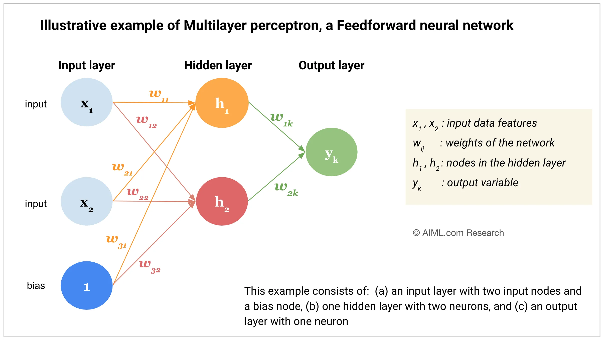

# Day 1 Notes: PyTorch Basics and MLP Theory

## 1. PyTorch

### 1.1. What is PyTorch?
- An open-source machine learning library.
- Developed by Facebook's AI Research lab.
- Provides two high-level features:
  - Tensor computation (like NumPy) with strong GPU acceleration.
  - Deep neural networks built on a tape-based autograd system.

### 1.2. Why PyTorch?
- Dynamic computational graph (define-by-run): easier to debug and more flexible.
- Pythonic and intuitive.
- Strong community and used in many research projects.

### 1.3. Tensors
- Tensors are the central data structure in PyTorch.
- They are similar to NumPy arrays but can run on GPUs.

#### 1.3.1. Creating Tensors
- `torch.tensor(data)`: creates a tensor from data (list, array, etc.).
- `torch.zeros(size)`: creates a tensor of all zeros.
- `torch.ones(size)`: creates a tensor of all ones.
- `torch.rand(size)`: creates a tensor with random values from a uniform distribution [0,1).

#### 1.3.2. Tensor Operations
- Addition: `torch.add(a, b)` or `a + b`
- Multiplication (element-wise): `torch.mul(a, b)` or `a * b`
- Matrix multiplication: `torch.matmul(a, b)`

#### 1.3.3. Tensor Attributes
- `tensor.shape`: returns the size of the tensor.
- `tensor.dtype`: returns the data type of the tensor.

#### 1.3.4. GPU Tensors
- Use `.to(device)` to move tensors to GPU.
- Check GPU availability: `torch.cuda.is_available()`

## 2. MLP (Multi-Layer Perceptron)

### 2.1. What is an MLP?
- A class of feedforward artificial neural network (ANN).
- Consists of at least three layers: input, hidden, and output.

### 2.2. Layers
1. **Input Layer**: Receives the input features. Number of neurons equals the number of features.
2. **Hidden Layers**: Perform nonlinear transformations of the inputs. Each neuron in a hidden layer uses an activation function.
3. **Output Layer**: Produces the final output. The number of neurons depends on the task (e.g., 1 for regression, 2 for binary classification).

### 2.3. Neurons
- Each neuron computes:
z = w1*x1 + w2*x2 + ... + wn*xn + b
a = activation(z)

where `w` are weights, `x` are inputs, `b` is bias, and `a` is the output.

### 2.4. Activation Functions
- **ReLU**: `f(x) = max(0, x)`
- **Sigmoid**: `f(x) = 1 / (1 + exp(-x))`
- **Tanh**: `f(x) = (exp(x) - exp(-x)) / (exp(x) + exp(-x))`

### 2.5. Why Multiple Layers?
- A single layer can only learn linear patterns.
- Multiple layers with non-linear activations allow the network to learn complex, non-linear patterns.

## 3. Diagrams

### 3.1. Simple MLP with One Hidden Layer
Input Layer (3) -> Hidden Layer (5) -> Output Layer (1)

- Input layer: 3 neurons (for 3 features)
- Hidden layer: 5 neurons
- Output layer: 1 neuron

### 3.2. Activation Functions Table
| Function | Formula | Range |
|----------|---------|-------|
| ReLU     | max(0, x) | [0, ∞) |
| Sigmoid  | 1 / (1 + e^(-x)) | (0, 1) |
| Tanh     | (e^x - e^(-x)) / (e^x + e^(-x)) | (-1, 1) |