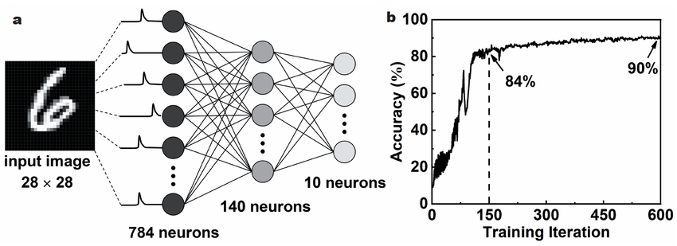

# Day 4 Revision – Core Neural Network Concepts

## 1. Artificial Neural Network (ANN)

An **Artificial Neural Network (ANN)** is a machine learning model inspired by the human brain.
It consists of **neurons** connected in layers that process input data and produce an output.

### Basic Structure

An ANN usually has three types of layers:

1. **Input layer** – receives the data
2. **Hidden layer(s)** – processes the data
3. **Output layer** – produces the final result

Each neuron:

* Receives inputs
* Multiplies them by weights
* Adds a bias
* Passes the result through an activation function

---

## 2. Multi-Layer Perceptron (MLP)

An **MLP** is a type of ANN where:

* Neurons are arranged in multiple layers
* Each layer is **fully connected** to the next

### Structure

Example:



* Input layer: 784 neurons (for 28×28 image)
* Hidden layer 1: 128 neurons
* Hidden layer 2: 64 neurons
* Output layer: 10 neurons (for 10 classes)

MLP is commonly used for:

* Classification
* Regression
* Basic deep learning tasks

---

## 3. Forward Propagation

**Forward propagation** is the process of passing input data through the network to get an output.

### Steps:

1. Input enters the first layer.
2. Each neuron computes:

   ```
   z = w·x + b
   ```
3. Apply activation function:

   ```
   a = activation(z)
   ```
4. Output passes to next layer.
5. Final output is produced.

---

## 4. Backpropagation

**Backpropagation** is the process of updating the network’s weights using the error from the output.

### Steps:

1. Calculate loss (error).
2. Compute gradients of loss w.r.t. weights.
3. Propagate gradients backward through the network.
4. Update weights using the optimizer.

### Basic weight update rule:

```
w = w − learning_rate × gradient
```

Purpose:

* Reduce the error
* Improve predictions

---

## 5. Loss Function

A **loss function** measures how wrong the model’s prediction is.

### Examples:

* **Mean Squared Error (MSE)** → for regression
* **Cross-Entropy Loss** → for classification

If:

* Prediction is accurate → loss is low
* Prediction is wrong → loss is high

Goal of training:

```
Minimize the loss
```

---

## 6. Optimizer

An **optimizer** updates the model’s weights to reduce the loss.

It uses gradients from backpropagation.

### Common optimizers:

* SGD (Stochastic Gradient Descent)
* Adam (most commonly used)

### Example update:

```
w = w − learning_rate × gradient
```

---

## 7. Epoch

An **epoch** is one complete pass of the entire training dataset through the model.

Example:

* Dataset: 60,000 images
* After model sees all 60,000 once → 1 epoch

Training usually uses:

* 5–50 epochs depending on the problem

---

## Simple Training Flow

```
Input → Forward Propagation → Prediction
           ↓
        Loss Calculation
           ↓
       Backpropagation
           ↓
        Weight Update
           ↓
         Next Epoch
```

---

## Key Idea

Training a neural network means:

* Repeating forward pass
* Calculating loss
* Updating weights
* Until the model becomes accurate


# Optimization Basics: GD, SGD, Loss vs Cost, and Adam

## 1. Gradient Descent vs Stochastic Gradient Descent

### Gradient Descent (GD)

**Gradient Descent** is an optimization algorithm used to minimize the loss by updating model weights.

In **standard Gradient Descent**, the model:

* Uses the **entire dataset** to compute the gradient
* Updates weights **once per epoch**

### Process:

1. Take all training data.
2. Compute total loss.
3. Compute gradient.
4. Update weights.

### Formula:

```
w = w − learning_rate × gradient
```

### Characteristics:

* Stable and smooth updates
* Slower for large datasets
* Requires more memory

---

### Stochastic Gradient Descent (SGD)

**Stochastic Gradient Descent** updates weights using **one sample at a time**.

Instead of using the full dataset:

* It picks one random sample
* Computes gradient
* Updates weights immediately

### Process:

For each training example:

1. Forward pass
2. Compute loss
3. Compute gradient
4. Update weights

### Characteristics:

* Much faster for large datasets
* Noisy updates (loss may fluctuate)
* Can escape local minima

---

### Key Differences

| Feature          | Gradient Descent | Stochastic Gradient Descent |
| ---------------- | ---------------- | --------------------------- |
| Data used        | Entire dataset   | One sample at a time        |
| Update frequency | Once per epoch   | After each sample           |
| Speed            | Slower           | Faster                      |
| Stability        | Smooth updates   | Noisy updates               |
| Memory usage     | High             | Low                         |

---

### Mini-Batch Gradient Descent (Most Common)

In practice, we use a middle approach:

* Use small batches (e.g., 32 or 64 samples)
* Called **Mini-batch Gradient Descent**
* Used in most deep learning frameworks

---

## 2. Loss Function vs Cost Function

### Loss Function

A **loss function** measures the error for **one training example**.

Example:

* Model predicts: 7
* True value: 10
* Loss = difference between them

So:

```
Loss = error for a single sample
```

---

### Cost Function

A **cost function** is the **average loss over the entire dataset**.

Example:
If you have 100 samples:

```
Cost = average of all 100 losses
```

So:

```
Cost = total error of the model
```

---

### Simple Difference

| Term          | Meaning                    |
| ------------- | -------------------------- |
| Loss function | Error for one sample       |
| Cost function | Average error over dataset |

In deep learning, people often use the terms **interchangeably**.

---

## 3. Adam Optimizer

### What is Adam?

**Adam** stands for:

```
Adaptive Moment Estimation
```

It is one of the most popular optimizers in deep learning.

It combines ideas from:

* Momentum
* RMSProp

---

### Key Idea

Adam:

* Tracks past gradients (momentum)
* Adjusts learning rate for each parameter

So:

* Important weights update faster
* Less important weights update slower

This makes training:

* Faster
* More stable
* Less sensitive to learning rate

---

### How Adam Works (Conceptually)

For each weight:

1. Compute gradient.
2. Compute moving average of gradients (momentum).
3. Compute moving average of squared gradients.
4. Adjust learning rate.
5. Update weight.

---

### Weight Update Concept

Basic GD:

```
w = w − lr × gradient
```

Adam:

```
w = w − adaptive_lr × adjusted_gradient
```

Where:

* Learning rate changes automatically
* Based on past gradients

---

### Advantages of Adam

* Fast convergence
* Works well on most problems
* Requires little tuning
* Default optimizer in many projects

---

### Typical Adam Settings

```
learning rate = 0.001
beta1 = 0.9
beta2 = 0.999
epsilon = 1e-8
```

In PyTorch:

```python
optimizer = torch.optim.Adam(model.parameters(), lr=0.001)
```

---

## Summary

* **GD:** Uses full dataset for each update.
* **SGD:** Uses one sample per update.
* **Loss:** Error for one sample.
* **Cost:** Average error for all samples.
* **Adam:** Smart optimizer with adaptive learning rates.
