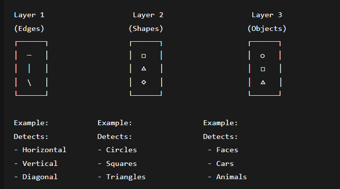
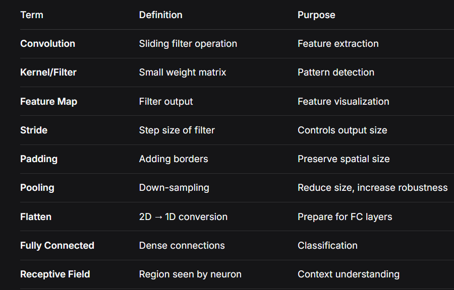

# Day 5: CNN Theory - Complete Guide
## 1. What is CNN?
CNN stands for Convolutional Neural Network. It's a specialized type of neural network designed specifically for processing grid-like data, particularly images.

Why CNN for Images?

Images have spatial structure: Pixels close to each other form meaningful patterns, here spatial means 2D. This spatial structure is important for many tasks, like object detection, image classification, and more.

Traditional MLP fails: Flattening an image loses spatial relationships because it's a 1D vector. MLP doesn't understand spatial relationships. But CNN can learn spatial relationships from images.

CNN preserves spatial information: Understands patterns based on pixel arrangements

What CNN Does:

Detects patterns like edges, textures, shapes, and objects

Learns hierarchical features: edges → textures → parts → objects

Automatically learns what patterns are important for the task

## 2. CNN Pipeline (Visual Architecture)
```

┌─────────────────────────────────────────────────────────┐
│                   CNN ARCHITECTURE                      │
├─────────────────────────────────────────────────────────┤
│                                                         │
│   INPUT IMAGE                                           │
│    ┌─────┐                                              │
│    │28x28│                                              │
│    │Gray │                                              │
│    └──┬──┘                                              │
│       │                                                 │
│       ▼                                                 │
│   ┌─────────────────┐                                   │
│   │  CONVOLUTION    │                                   │
│   │  + ReLU         │  ←── Detects features             │
│   └──────┬──────────┘                                   │
│          │                                              │
│          ▼                                              │
│   ┌─────────────────┐                                   │
│   │    POOLING      │  ←── Reduces size                 │
│   │  (MaxPool)      │      Keeps important info         │
│   └──────┬──────────┘                                   │
│          │                                              │
│          ▼                                              │
│   ┌─────────────────┐                                   │
│   │   CONVOLUTION   │  ←── Detects higher-level         │
│   │   + ReLU        │      features                     │
│   └──────┬──────────┘                                   │
│          │                                              │
│          ▼                                              │
│   ┌─────────────────┐                                   │
│   │    POOLING      │  ←── Further size reduction       │
│   └──────┬──────────┘                                   │
│          │                                              │
│          ▼                                              │
│   ┌─────────────────┐                                   │
│   │    FLATTEN      │  ←── Convert 2D → 1D              │
│   └──────┬──────────┘                                   │
│          │                                              │
│          ▼                                              │
│   ┌─────────────────┐                                   │
│   │ FULLY CONNECTED │  ←── Classification               │
│   │    LAYERS       │                                   │
│   └──────┬──────────┘                                   │
│          │                                              │
│          ▼                                              │
│   ┌─────────────────┐                                   │
│   │     OUTPUT      │  ←── Final prediction             │
│   │   (Digit 0-9)   │                                   │
│   └─────────────────┘                                   │
│                                                         │
└─────────────────────────────────────────────────────────┘
```
## 3. Core Concepts Explained
### Convolution
Definition: A mathematical operation where a small matrix (filter) slides over the input image, performing element-wise multiplication and summing the results.

Analogy: Like shining a flashlight over a dark image - you see small portions at a time, looking for specific patterns.

Visual Representation:

```
Input Image (5x5)           Filter (3x3)           Output Pixel
┌───┬───┬───┬───┬───┐      ┌───┬───┬───┐
│ 1 │ 2 │ 3 │ 4 │ 5 │      │ 1 │ 0 │ 1 │         (1×1 + 2×0 + 3×1) +
├───┼───┼───┼───┼───┤      ├───┼───┼───┤         (4×0 + 5×1 + 6×0) +
│ 4 │ 5 │ 6 │ 7 │ 8 │      │ 0 │ 1 │ 0 │         (7×1 + 8×0 + 9×1) = 25
├───┼───┼───┼───┼───┤      ├───┼───┼───┤
│ 7 │ 8 │ 9 │10 │11 │      │ 1 │ 0 │ 1 │
├───┼───┼───┼───┼───┤      └───┴───┴───┘
│10 │11 │12 │13 │14 │
├───┼───┼───┼───┼───┤
│13 │14 │15 │16 │17 │
└───┴───┴───┴───┴───┘

                    ↓
            ┌───────────────┐
            │  25 │ 30 │ 35 │
            ├───────────────┤
            │  40 │ 45 │ 50 │
            ├───────────────┤
            │  55 │ 60 │ 65 │
            └───────────────┘
            Feature Map (3x3)
```
### Kernel / Filter
Definition: A small matrix (typically 3x3, 5x5) that contains weights learned during training. Each filter detects a specific pattern.

Types of Filters and What They Detect:

```
Edge Detector        Sharpening           Blur
┌───┬───┬───┐      ┌───┬───┬───┐      ┌───┬───┬───┐
│-1 │-1 │-1 │      │ 0 │-1 │ 0 │      │ 1 │ 2 │ 1 │
├───┼───┼───┤      ├───┼───┼───┤      ├───┼───┼───┤
│-1 │ 8 │-1 │      │-1 │ 5 │-1 │      │ 2 │ 4 │ 2 │
├───┼───┼───┤      ├───┼───┼───┤      ├───┼───┼───┤
│-1 │-1 │-1 │      │ 0 │-1 │ 0 │      │ 1 │ 2 │ 1 │
└───┴───┴───┘      └───┴───┴───┘      └───┴───┴───┘
```
Key Properties:

Size: Usually odd (3x3, 5x5) to have a center pixel

Depth: Matches input depth (1 for grayscale, 3 for RGB)

Number: Multiple filters per layer (16, 32, 64, etc.)

Learnable: Values adjust during training to detect useful patterns

### Feature Map
Definition: The output after applying a filter to an image. Each feature map highlights where a particular pattern appears in the image.

Analogy: Like a heat map showing where the network "sees" specific features.

Characteristics:

Each filter produces one feature map

Multiple filters → Multiple feature maps (channels)

Size depends on input size, filter size, and padding

Values represent "strength" of pattern detection

Example:

```
Input Image      Filter (edge detector)      Feature Map
   ┌─┐                  ┌─┐                    ┌─┐
   │ │                  │ │                    │ │
   └─┘                  └─┘                    └─┘
   Cat                  Detects                Highlights
   photo                vertical               edges
                        edges
```                        
### Pooling
Definition: A down-sampling operation that reduces the spatial size of feature maps while keeping the most important information.

Why Pooling?

Reduces computational load

Makes detection more robust (small shifts don't matter)

Prevents overfitting

Creates spatial invariance ,for example if you rotate the image, the network still sees the same object 

Types of Pooling:

Type	            Operation	               Example (2x2, stride 2); Stride means how many pixels to skip at each step
Max Pooling	        Take maximum value	       [1, 3; 5, 7] → 7
Average Pooling	    Take average               [1, 3; 5, 7] → 4

Visual Example of Max Pooling:

```
Feature Map (4x4)           After Max Pooling (2x2) [stride 2 → skip 2 pixels like it skips a row or column which is 2 pixels]
┌───┬───┬───┬───┐          ┌───┬───┐                
│ 1 │ 3 │ 2 │ 4 │          │ 7 │ 8 │
├───┼───┼───┼───┤   →      ├───┼───┤
│ 5 │ 7 │ 6 │ 8 │          │15 │16 │
├───┼───┼───┼───┤          └───┴───┘
│ 9 │11 │10 │12 │
├───┼───┼───┼───┤
│13 │15 │14 │16 │
└───┴───┴───┴───┘
```
Parameters:

Kernel size: Size of pooling window (usually 2x2 matrix)

Stride: Step size (usually 2) to skip pixels

Result: Width and height roughly halved or smaller than input

### Flatten
Definition: The operation that converts the 2D feature maps into a 1D vector so it can be fed into fully connected layers. In other words, it "flattens" the feature maps into a single vector. It is done to make the data suitable for classification otherwise it would be too high-dimensional.

Visual Transformation:

```
Before Flatten (3 feature maps, each 2x2):
┌─────┐ ┌─────┐ ┌─────┐
│ 1 2 │ │ 5 6 │ │ 9 0 │
│ 3 4 │ │ 7 8 │ │ 1 2 │
└─────┘ └─────┘ └─────┘
```
After Flatten:

[1, 2, 3, 4, 5, 6, 7, 8, 9, 0, 1, 2]

(12 elements total) (4*3=12)

Why Flatten?

#### Fully connected layers expect 1D input

Preserves all information (just rearranged)

Bridge between convolutional and classification parts

Calculation:

If last conv layer outputs:
    - 16 feature maps
    - each 7x7 in size
    
Flattened size = 16 × 7 × 7 = 784 elements


### Fully Connected Layer
Definition: Traditional neural network layer where every input connects to every output with learnable weights.

Purpose in CNN:

Takes high-level features from convolutions

Performs final classification

Maps features to class probabilities

Architecture:

```
Flattened Vector (784)     Hidden Layer (128)     Output Layer (10)
    [1] ────────┐
    [2] ──────┐ │          ┌─┐                   ┌─┐
    [3] ────┐ │ │          │ │                   │0│
    [4] ──┐ │ │ │          │ │                   ├─┤
    ...   │ │ │ │   →      │ │   →               │1│
    [783] │ │ │ │          │ │                   ├─┤
    [784]─┘ │ │ │          │ │                   │9│
            └─┴─┴─┘        └─┘                   └─┘
            
Parameters:784 inputs     128 neurons           10 outputs (10 classes like for MNIST 0-9 digits)

```
Weights: input_size × output_size

Biases: output_size

## 4. Feature Hierarchy in CNN
CNN learns increasingly complex features layer by layer:



## 5. Complete Example: CNN for Digit Recognition
Network Architecture:
```
Layer Type        Output Shape        Parameters
─────────────────────────────────────────────────
Input             (1, 28, 28)         0
│
Conv2D (16 filters, 3x3)  
→ ReLU             (16, 26, 26)        160 (16×3×3 + 16)
│
MaxPool (2x2)      (16, 13, 13)        0
│
Flatten            (2704)              0
│
Linear (128)       (128)               346,112 (2704×128 + 128)
│
Linear (10)        (10)                1,290 (128×10 + 10)
│
Output             (10)                0
─────────────────────────────────────────────────
Total Parameters: ~347,562
```
Forward Pass Step-by-Step:

```
Step 1: Input
Image: 28×28 grayscale
Values: 0.0 to 1.0
Shape: (1, 28, 28) (1 image, 28 rows, 28 columns)


Step 2: First Convolution (here we detect edges)
16 filters of size 3×3
Each filter slides over image
Output: 16 feature maps of size 26×26 (16 features because of 16 filters each of size 26×26 because 28-3+1=26)
Shape: (16, 26, 26)


Step 3: ReLU Activation
Max(0, x) applied to every value
Negative values become 0
Shape: (16, 26, 26)


Step 4: Max Pooling (here we reduce size,only size is reduced not number of feature maps)
2×2 window, stride 2
Take maximum in each window (we take the largest value in each 2x2 window)
Size reduces: 26×26 → 13×13 (26-2+1=13 because stride is 2)
Shape: (16, 13, 13) (16 feature maps, 13 rows, 13 columns)


Step 5: Flatten (2D to 1D conversion to feed into fully connected(FC) layers, fully connected means each neuron is connected to every other neuron)
16 × 13 × 13 = 2704 values
Convert to 1D vector
Shape: (2704)


Step 6: Fully Connected Layers(here we learn to classify digits)
First FC: 2704 → 128 neurons
Second FC: 128 → 10 neurons (logits, logits means raw scores, not probabilities)
Shape: (10)


Step 7: Output
10 values (logits) for digits 0-9
Apply softmax for probabilities (softmax(x) = exp(x) / sum(exp(x)), it converts logits to probabilities in the range of 0 to 1)
Prediction = argmax(logits) (argmax returns index of maximum value for example if logits=[0.1, 0.2, 0.3, 0.4, 0.5, 0.6, 0.7, 0.8, 0.9, 1.0], argmax(logits) = 9 because 1.0 is the maximum value which is at index 9 so prediction is 9)
```

## 6. Key Advantages of CNN
```
Advantage	                            Explanation
Parameter Sharing	                    Same filter used across entire image → fewer parameters
Sparsity of Connections	                Each neuron connects to only local region → efficient
Translation Invariance	                Can detect patterns anywhere in image
Hierarchical Learning	                Learns simple to complex features automatically
Spatial Information Preserved	        Maintains 2D structure until flatten
```

## 7. Common CNN Terminology Summary




8. Memory Aid: CNN in 5 Steps
```
1. CONVOLVE: Slide filters over image → Find patterns
2. ACTIVATE: ReLU → Remove negatives
3. POOL: Downsample → Keep important features
4. FLATTEN: 2D → 1D → Prepare for classification
5. CLASSIFY: Fully connected layers → Make prediction
```
Mnemonic: Cats Always Play For Cuddles

Convolve

Activate

Pool

Flatten

Classify

## 9. Quick Reference: Code to Concept Mapping

### PyTorch code → What it means
```
nn.Conv2d(1, 16, 3)      # 16 filters of size 3×3 on 1-channel input, 1 channel means grayscale image not RGB
nn.ReLU()                # Remove negative values (non-linearity)
nn.MaxPool2d(2, 2)       # 2×2 max pooling, stride 2 (halve size)
nn.Flatten()             # Convert 2D feature maps to 1D
nn.Linear(2704, 128)     # Fully connected: 2704 → 128 neurons
```
## 10. Today's Implementation Summary
In today's code, we built:

```
SimpleCNN(
  (conv1): Conv2d(1, 16, kernel_size=3)     # 16 filters
  (pool): MaxPool2d(2, 2)                   # Downsample by half
  (fc1): Linear(2704, 10)                   # Direct to 10 classes
)

Forward Pass:
Input (1,28,28) 
→ Conv (16,26,26)  # 16 filters, size 3x3, output size 26x26
→ ReLU (16,26,26) 
→ Pool (16,13,13)  # Downsample by half, size reduces
→ Flatten (2704)   # 2d to 1d
→ Linear (10)      # 2704 → 10
→ Output (10)      # Classify into 10 classes
```
This simple CNN already achieves ~97% accuracy on MNIST!

CNNs are the foundation of modern computer vision. These concepts deeply help us to understand Transfer Learning, GANs, Vision Transformers, and Multimodal models.