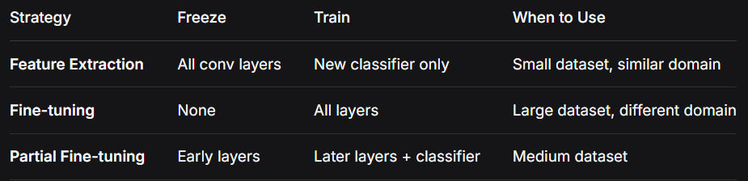
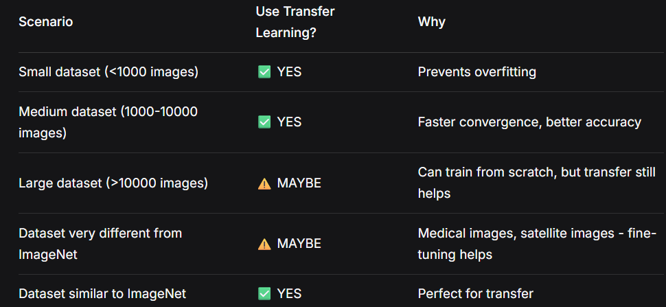

## Day 7: Transfer Learning - Complete Theory Guide
### 1. What is Transfer Learning?
Transfer Learning is a machine learning technique where a model developed for one task is reused as the starting point for a model on a second task.

Simple Analogy:
```
Learning to ride a bicycle → Helps learning to ride a motorcycle
Already know: balance, steering, braking
Only need to learn: throttle, gears, different controls
```
**In Deep Learning Terms:**

Instead of training a CNN from scratch with random weights, we start with a model that was already trained on millions of images (like ImageNet's 1.2 million images). 

Then we:

Keep the learned features (edges, shapes, textures)

Replace the final classification layer

Train only the new parts (or fine-tune everything)

### 2. Why Transfer Learning Works
**Universal Features in Early Layers**

**All images share common low-level patterns:**

```
Layer 1                      Layer 2                    Layer 3
(Edges)                     (Shapes)                   (Objects)
┌──────┐                    ┌──────┐                   ┌──────┐
│  ─   │                    │  □   │                   │  ○   │
│  │   │                    │  △   │                   │  □   │
│  \   │                    │  ◇   │                   │  △   │
└──────┘                    └──────┘                   └──────┘

Universal:                 Universal:                 Task-specific:
- Horizontal edges         - Circles                   - Dog faces
- Vertical edges           - Squares                   - Car wheels  
- Diagonal edges           - Triangles                 - Cat ears
- Textures                 - Rectangles                 - Human eyes
```
Knowledge Transfer Visualization:
```
Model trained on ImageNet (dogs, cats, cars, boats, ...)
                    ↓
Learns general features: edges → shapes → textures → parts
                    ↓
These features work for ANY image task
                    ↓
MNIST digits also have edges, curves, shapes
                    ↓
Model already knows how to detect these!
                    ↓
Only needs to learn: which combinations make which digits
```
### 3. Key Terminology
1️⃣ Pretrained Model

A model that has already been trained on a large dataset (usually ImageNet) before being used for your task.

Examples: (pretrained Models )

ResNet18 (trained on 1.2M images)

VGG16 (trained on 1.2M images)

EfficientNet (trained on 1.2M images)

2️⃣ Feature Extractor

The early layers of a CNN that detect general patterns (edges, textures, shapes). These are universal and can be reused across different tasks.

3️⃣ Fine-tuning

The process of taking a pretrained model and continuing training on your specific dataset, either:

Training only the new **classifier layers**

Training all layers with a **lower learning rate**

4️⃣ Freezing Layers
Preventing certain layers from being updated during training. This preserves the pretrained features like convolution layers in CNN.


### Freeze all layers
```
for param in model.parameters():
    param.requires_grad = False
```    
5️⃣ Domain Adaptation

When the source domain (ImageNet) and target domain (MNIST) are different but share underlying features.

4. Transfer Learning Strategies



Visual Comparison:
```
┌─────────────────────────────────────────────────────┐
│                    FEATURE EXTRACTION               │
├─────────────────────────────────────────────────────┤
│  Conv Layers (Frozen)   │   New Classifier (Train)  │
│  ┌───┬───┬───┬───┐      │       ┌─────────┐         │
│  │░░░│░░░│░░░│░░░│      │       │ ░░░░░░░ │         │
│  │░░░│░░░│░░░│░░░│      │       │ ░░░░░░░ │         │
│  │░░░│░░░│░░░│░░░│      │       │ ░░░░░░░ │         │
│  └───┴───┴───┴───┘      │       └─────────┘         │
├─────────────────────────────────────────────────────┤
│                    FINE-TUNING                      │
├─────────────────────────────────────────────────────┤
│  All Layers (Train with small Learning Rate)        │
│  ┌───┬───┬───┬───┐      ┌─────────┐                 │
│  │▓▓▓│▓▓▓│▓▓▓│▓▓▓│      │ ▓▓▓▓▓▓▓ │                 │
│  │▓▓▓│▓▓▓│▓▓▓│▓▓▓│      │ ▓▓▓▓▓▓▓ │                 │
│  │▓▓▓│▓▓▓│▓▓▓│▓▓▓│      │ ▓▓▓▓▓▓▓ │                 │
│  └───┴───┴───┴───┘      └─────────┘                 │
├─────────────────────────────────────────────────────┤
│              PARTIAL FINE-TUNING                    │
├─────────────────────────────────────────────────────┤
│  Early (Frozen)  Later (Train)    Classifier (Train)│
│  ┌───┬───┐      ┌───┬───┐        ┌─────────┐        │
│  │░░░│░░░│      │▓▓▓│▓▓▓│        │ ▓▓▓▓▓▓▓ │        │
│  │░░░│░░░│      │▓▓▓│▓▓▓│        │ ▓▓▓▓▓▓▓ │        │
│  └───┴───┘      └───┴───┘        └─────────┘        │
└─────────────────────────────────────────────────────┘
```
### 5. Advantages of Transfer Learning
✅ Faster Training

From scratch: 50 epochs to converge

Transfer learning: 2-5 epochs to converge

✅ Less Data Required

From scratch: Needs 1000s of images per class

Transfer learning: Works with 10s-100s of images

✅ Better Performance

Leverages knowledge from millions of images

More robust features

Better generalization

✅ Lower Computational Cost

Less training time

Smaller carbon footprint

Accessible on limited hardware

### 6. When to Use Transfer Learning


### 7. ResNet18 Architecture Understanding

What is ResNet?

ResNet = Residual Network, introduced by Microsoft in 2015.

Key Innovation: Skip Connections
text
Traditional CNN:
Input → Conv → ReLU → Conv → ReLU → Output
         ↓                    ↑
         └── Information flow ──┘
         (May lose information)

ResNet with Skip Connection:
Input ──────────────────────────┐
         ↓                       │
Input → Conv → ReLU → Conv → ReLU + → Output
         ↓                    ↑    │
         └── Information flow ──┘   │
         (Preserves information)    │
         └──────────────────────────┘
Why Skip Connections Matter:
Deeper networks possible (up to 152 layers!)

Vanishing gradient problem solved

Information flow preserved

ResNet18 Structure:
text
Layer Name    Output Size    Layers
────────────────────────────────────
Conv1         112×112        7×7, 64, stride 2
MaxPool       56×56           3×3, stride 2
────────────────────────────────────
Layer1        56×56           [3×3, 64] × 2
                              [3×3, 64]
────────────────────────────────────
Layer2        28×28           [3×3, 128] × 2
                              [3×3, 128]
────────────────────────────────────
Layer3        14×14           [3×3, 256] × 2
                              [3×3, 256]
────────────────────────────────────
Layer4        7×7             [3×3, 512] × 2
                              [3×3, 512]
────────────────────────────────────
Average Pool  1×1             7×7 global average
FC            1000            1000 classes
────────────────────────────────────
8. Adapting ResNet18 for MNIST
Required Modifications:
1. Input Size:

text
ResNet expects: 224×224 RGB (3 channels)
MNIST has:      28×28 grayscale (1 channel)
Solution:       Resize to 224×224, convert grayscale→RGB
2. Output Classes:

text
ResNet original: 1000 classes (ImageNet)
MNIST needs:     10 classes (digits 0-9)
Solution:        Replace final layer
Visual of Adaptation:
text
Original ResNet18:
[Conv Layers] → [AvgPool] → [FC (1000)] → [Output 1000 classes]
     ↓              ↓            ↓
  Pretrained    Pretrained   Random
   (frozen)      (frozen)    (replace)

Our Adapted ResNet18:
[Conv Layers] → [AvgPool] → [FC (10)] → [Output digit 0-9]
     ↓              ↓          ↓
  Pretrained    Pretrained   Trainable
   (frozen)      (frozen)    (new layer)
9. Step-by-Step Transfer Learning Process
Step 1: Load Pretrained Model
python
model = models.resnet18(pretrained=True)
Downloads weights trained on ImageNet

Sets up complete architecture

Step 2: Freeze Convolutional Layers
python
for param in model.parameters():
    param.requires_grad = False
Prevents pretrained features from being destroyed

Saves computation time

Step 3: Replace Classifier
python
model.fc = nn.Linear(model.fc.in_features, 10)
Removes old 1000-class classifier

Adds new 10-class classifier

New layer starts with random weights

Step 4: Train Only New Layers
python
optimizer = optim.Adam(model.fc.parameters(), lr=0.001)
Only updates the new classifier

Preserves all pretrained features

10. Comparison: From Scratch vs Transfer Learning
Aspect	Training from Scratch	Transfer Learning
Starting point	Random weights	ImageNet pretrained
Training time	50+ epochs	2-5 epochs
Data needed	1000s per class	10s-100s per class
Accuracy (small data)	Poor	Excellent
Convergence	Slow	Fast
Computational cost	High	Low
Expected Results on MNIST:
text
Model Type        Epochs to 95%    Final Accuracy
────────────────────────────────────────────────────
MLP from scratch       15               ~97%
CNN from scratch        5               ~99%
ResNet18 (transfer)     1               ~99.5%
11. Common Transfer Learning Architectures
Model	Year	Parameters	Best For
ResNet18	2015	11.7M	General purpose, small/medium
ResNet50	2015	25.6M	Higher accuracy, more compute
VGG16	2014	138M	Simple architecture
EfficientNet	2019	5.3-66M	State-of-the-art efficiency
MobileNet	2017	4.2M	Mobile/edge deployment
12. Memory Aid: Transfer Learning in 5 Steps
text
1. LOAD: Get pretrained model (already knows features)
2. FREEZE: Lock conv layers (preserve knowledge)
3. REPLACE: Swap classifier head (for your task)
4. TRAIN: Only new layers (learn task-specific)
5. EVALUATE: Test performance (should be excellent!)

Mnemonic: "Learning From Really Good Teachers"
- Load pretrained
- Freeze features
- Replace head
- Gently train
- Test accuracy
13. Important Notes and Caveats
⚠️ When Transfer Learning Might NOT Work:
Target domain completely different from ImageNet (e.g., medical X-rays)

Very small dataset AND different domain

Need for real-time inference on edge devices

💡 Best Practices:
Always normalize inputs to match pretrained model's expectations

Use smaller learning rate for fine-tuning (1/10 of normal)

Start with frozen features, then gradually unfreeze if needed

Monitor for overfitting (especially with small datasets)

🔬 Research Insight:
Your progression shows a clear learning trajectory:

text
MLP (simple) → CNN (custom) → ResNet (transfer)
    ↓              ↓               ↓
  Baseline     Better features   Best performance
    ↓              ↓               ↓
  From scratch   From scratch     Pretrained
    ↓              ↓               ↓
  ~97%           ~99%            ~99.5%
This demonstrates why transfer learning is the standard approach in modern computer vision research and applications!

